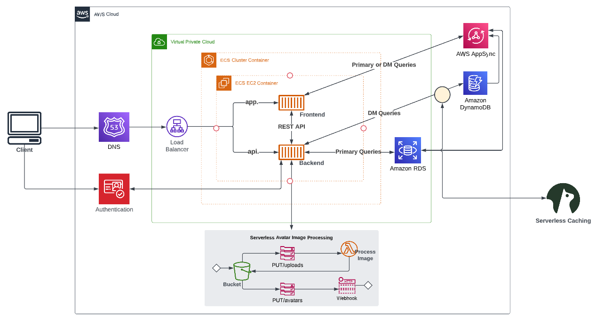

# Week 0 — Billing and Architecture

## Install AWS CLI

I am using Gitpod, so I installed AWS CLI on my Gitpod workspace.

Below are the instructions I used to install AWS CLI in our Gitpod workspace and configure it.

## Logical Diagram for the Application

I used Lucid Charts to create a logical diagram for our appliaction.

Here's the diagram and the link to [Lucid Chart Document](https://lucid.app/lucidchart/da419696-ad18-407a-b949-016cc2433753/edit?viewport_loc=-1489%2C797%2C2731%2C1223%2C0_0&invitationId=inv_7479a31a-9b5e-4dea-9261-031a10d019db)

